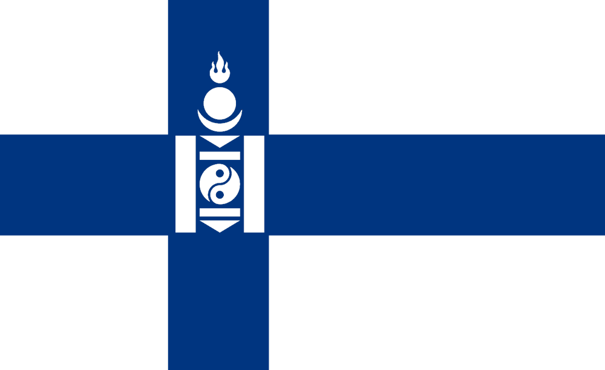
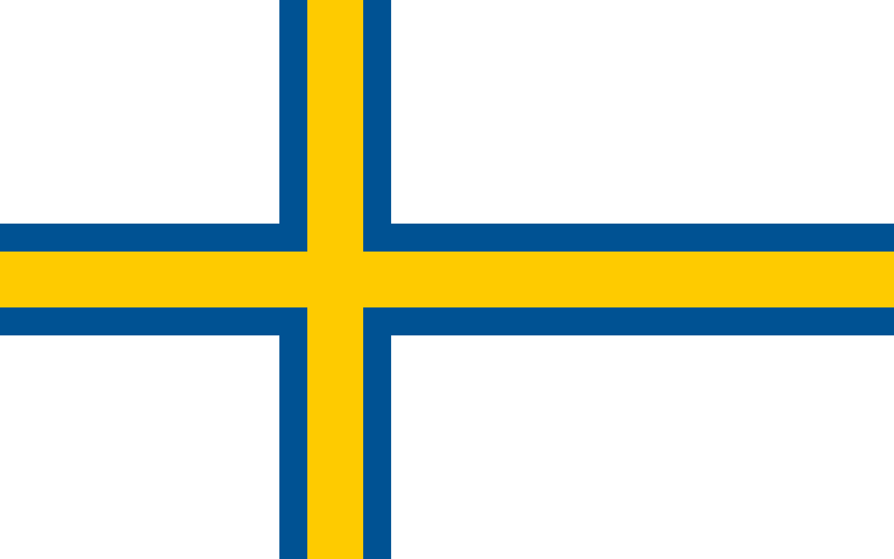

All our server instances have dedicated cores, meaning performance should be stable, reliable and predictable.

We offer hosting in Finland & Sweden. Some servers are completely managed by us while others are in datacenters. If you need help, want specialized hosting or have other needs don't hesitate to [contact us](/about).

We always offer best effort support and backups free of charge.

## Finngolian Hosting

Hosted in Helsinki, Finland.

Intel Core i7-8700, 16 GB RAM. 

More than enough for most minecraft servers be it SMP, modded or with lots of plugins.

[Buy now - €11.99/month](https://billing.molerat.org)

## Hosting in Norrland

Hosted in Medelpad, Sweden.

AMD Ryzen 5 5600X. 

RAM and pricing negotiable. Slightly interested? Please [contact us](/about).
